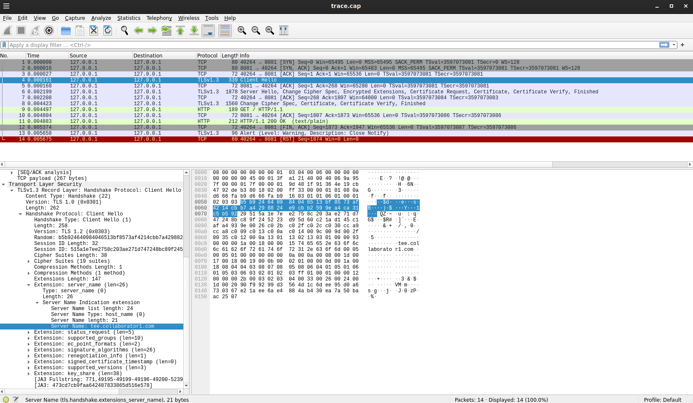
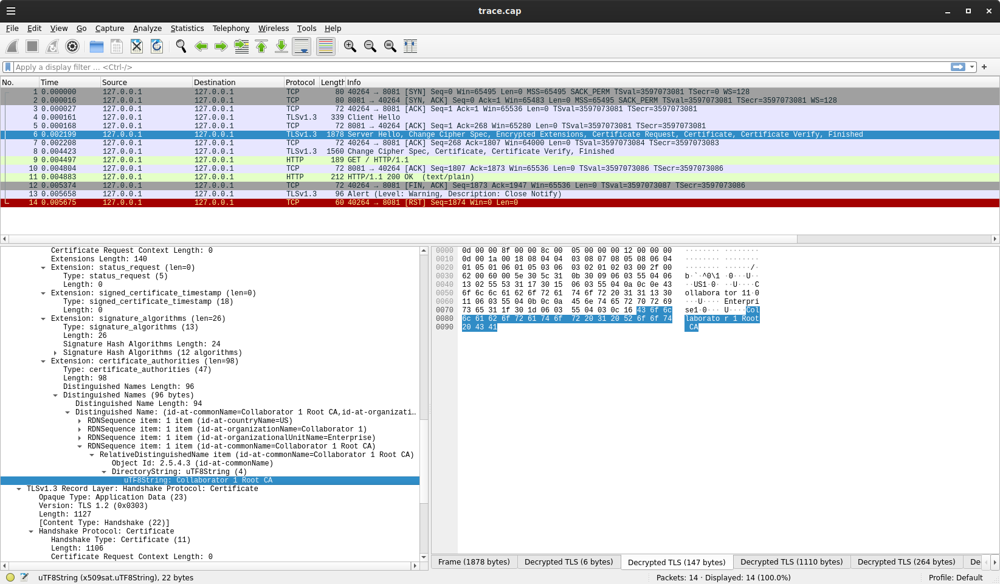
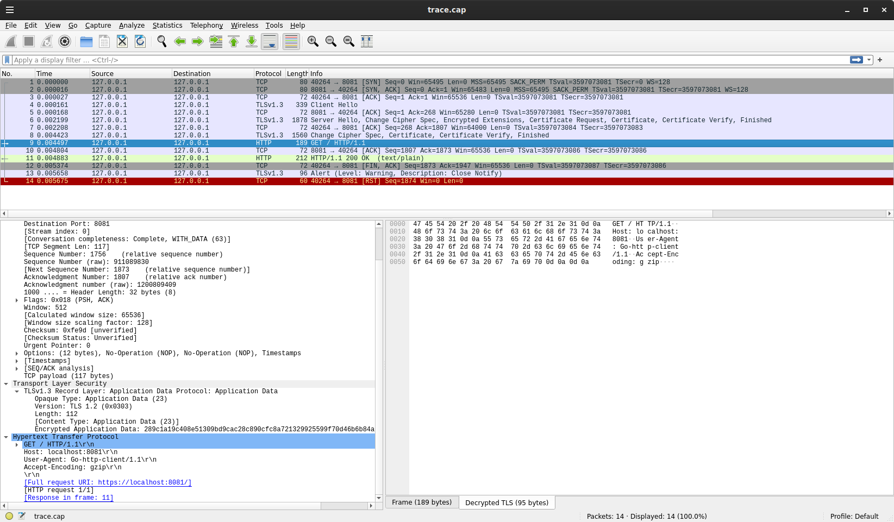
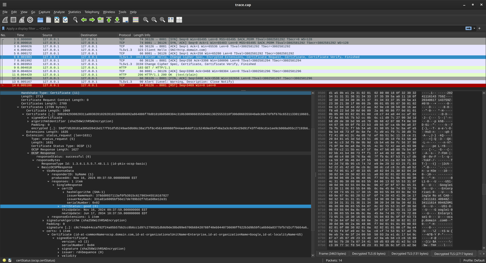
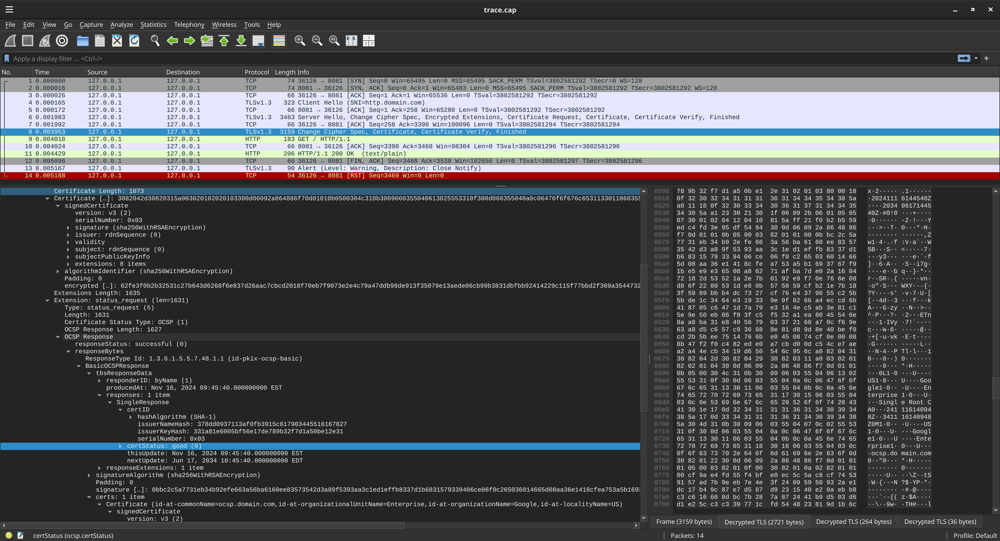

## go mTLS with multiple certificate issuers and OCSP verification

Sample client/server application which does the following:

1. Suppose there are two CAs that issue client certificates (`ca1`, `ca2`).

2. These two CAs also issue server a certificate each with different SNIs (`tee.collaborator1.com`, `tee.collaborator2.com`)

3. The server will load the two server certificates from these two CAs.

4. The server will enforce mTLS where the client certificates are issued by the corresponding CAs.

5. The client will load the client certificates and server CA certificate for _one_ of the two issuers and connect to the server while specifying an appropriate `SNI` value

6. During TLS negotiation, the server will return the server cert that maps to `SNI` sent by the client

7. During TLS negotiation, the server will return the set of client certificate CA's it accepts.

8. Client will verify the server's cert CA issuer from the loaded CA in step 5.

9. Client will negotiate mTLS using the client certs in step 5.

10. Server will verify the client certificate using the server certs from step 3.

11. Server will optionally invoke an external OCSP request to verify live that the client certificate presented has not been revoked


---

For gRPC, the tests here only verifies against ca1 but demonstrates the [AdvancedTLS](https://pkg.go.dev/google.golang.org/grpc/security/advancedtls) package.   You can find the examples under the `grpc` folder


---

also see

* [mTLS with TPM bound private key](https://github.com/salrashid123/go_tpm_https_embed)
* [mTLS with PKCS11](https://github.com/salrashid123/mtls_pkcs11)

---

### Setup

Run Server

```bash
go run server/server.go 
```

Try to make a connection to the server without specifying any certificates:

The response will show a 'default' server certificate `tee.operator.com` and the list of CA's it accepts.

The default certificate was shown because we did not specify an SNI value (eg `-servername tee.collaborator1.com`)

```bash
$ openssl s_client --connect localhost:8081

---
Certificate chain
 0 s:C = US, O = Google, OU = Enterprise, CN = tee.operator.com             <<<<<<<<
   i:C = US, O = Operator, OU = Enterprise, CN = Enterprise Root CA

---
Server certificate

subject=C = US, O = Google, OU = Enterprise, CN = tee.operator.com
issuer=C = US, O = Operator, OU = Enterprise, CN = Enterprise Root CA
---
Acceptable client certificate CA names
C = US, O = Collaborator 1, OU = Enterprise, CN = Collaborator 1 Root CA
C = US, O = Collaborator 2, OU = Enterprise, CN = Collaborator 2 Root CA
```

### Run Client

Now run the clients:

```bash
## collaborator 1
go run client/client.go --serverName tee.collaborator1.com --serverCertRootCA ca1/root-ca.crt --clientCert ca1/client.crt --clientKey ca1/client.key
## collaborator 2
go run client/client.go --serverName tee.collaborator2.com --serverCertRootCA ca2/root-ca.crt --clientCert ca2/client.crt --clientKey ca2/client.key
```

What you should see on the server config is a pair of connections from the clients:

```
$ go run server/server.go 
Subject CN=client.collaborator1.com,OU=Enterprise,O=Google,L=US
Client Certificate hash KK8-CThe_W9i0FWTX7L-DMbvsuCvv5K10m6fWJO--MA

Subject CN=client.collaborator2.com,OU=Enterprise,O=Google,C=US
Client Certificate hash Pkapc_CwEq12asjxrJ5mdn5_1MV2NNDosQ44hxbcwG0
```

### Emit client certificate hash

The sever also generates and prints the client certificate hash for use with [Token Binding](https://connect2id.com/learn/token-binding)

```bash
$ echo `openssl x509 -in ca1/client.crt -outform DER | openssl dgst -sha256 | cut -d" " -f2` | xxd -r -p - | openssl enc -a | tr -d '=' | tr '/+' '_-'
KK8-CThe_W9i0FWTX7L-DMbvsuCvv5K10m6fWJO--MA
```

also see

* [Certificate Bound Tokens using Security Token Exchange Server (STS)](https://github.com/salrashid123/cert_bound_sts_server)
* [Envoy WASM and LUA filters for Certificate Bound Tokens](https://github.com/salrashid123/envoy_cert_bound_token)

### Exported Key Material

Both the client and server will print the common [Exported Key Material rfc5705](https://www.rfc-editor.org/rfc/rfc5705.html) from the established [ConnectionState.ExportKeyingMaterial](https://pkg.go.dev/crypto/tls#ConnectionState.ExportKeyingMaterial).  This can be used for binding.


The net result is you should get the same per-conn data on both ends of the connection

```bash
$ go run server/server.go 
Starting Server..
EKM my_nonce: 1efe1f9d73fcaefb59d10a898592759c6a1bae792f8fbfce80ca7db72202e06b   <<<<<<<<<<<<<<<

$ go run client/client.go --serverName tee.collaborator1.com --serverCertRootCA ca1/root-ca.crt --clientCert ca1/client.crt --clientKey ca1/client.key
EKM my_nonce: 1efe1f9d73fcaefb59d10a898592759c6a1bae792f8fbfce80ca7db72202e06b   <<<<<<<<<<<<<<<
```

### SSL KeyLog

If you want to see the decrypted tls traces using wireshark, enable the `SSLKEYLOGFILE` writer within the `TLSConfig`

```
sudo tcpdump -s0 -iany -w trace.cap port 8081
```

```bash
export SSLKEYLOGFILE=/tmp/keylog.log
go run server/server.go
```

run client

```bash
cd tcpdump/
wireshark trace.cap --log-level=debug -otls.keylog_file:keylog.log
```

* Client->Server SNI



* Server->Client Client CA issuers



* Server->Client HTTP Decrypted




also see

* [OpenSSL 3.0.0 docker with TLS trace enabled (enable-ssl-trace) and FIPS (enable-fips)](https://github.com/salrashid123/openssl_trace)
* [Using Wireshark to decrypt TLS gRPC Client-Server protobuf messages](https://github.com/salrashid123/grpc_sslkeylog)

#### OCSP Check

The server  can also make an OCSP API call to verify the client' certificates revocation status at runtime.

To use this, you need to run an ocsp server which in the following is trough `openssl`

```bash
cd ca1/ca_scratchpad

## start OCSP Server
openssl ocsp -index ca/root-ca/db/root-ca.db -port 9999 -rsigner ca/root-ca.crt -rkey ca/root-ca/private/root-ca.key -CA ca/root-ca.crt -text -ndays 10

## in new windows, test ocsp server with revoked cert 
openssl ocsp -CA ca/root-ca.crt -CAfile ca/root-ca.crt -issuer ca/root-ca.crt  -cert certs/revoked.crt -url http://localhost:9999 -resp_text
### note Cert Status: revoked

### test ocsp server with valid cert
openssl ocsp -CA ca/root-ca.crt -CAfile ca/root-ca.crt -issuer ca/root-ca.crt  -cert certs/tee.crt -url http://localhost:9999 -resp_text
### note Cert Status: good

```

now run the server with ocsp enabled

```bash
## run server
$ go run server/server.go --check_ocsp

## run client
$ go run client/client.go --serverName tee.collaborator1.com --serverCertRootCA ca1/root-ca.crt --clientCert ca1/client.crt --clientKey ca1/client.key

```

The ocsp server will show the request, validation and response

```text
$ openssl ocsp -index ca/root-ca/db/root-ca.db -port 9999 -rsigner ca/root-ca.crt -rkey ca/root-ca/private/root-ca.key -CA ca/root-ca.crt -text -ndays 10

ACCEPT 0.0.0.0:9999 PID=187589
ocsp: waiting for OCSP client connections...
ocsp: Received request, 1st line: POST / HTTP/1.1
OCSP Request Data:
    Version: 1 (0x0)
    Requestor List:
        Certificate ID:
          Hash Algorithm: sha1
          Issuer Name Hash: 10CA8300F670BDF813C03C0CD3DACE5EA8AAB355
          Issuer Key Hash: 750D12CCDB33ED58068CADED0E9E2F00E96FC165
          Serial Number: 01
OCSP Response Data:
    OCSP Response Status: successful (0x0)
    Response Type: Basic OCSP Response
    Version: 1 (0x0)
    Responder Id: C = US, O = Collaborator 1, OU = Enterprise, CN = Collaborator 1 Root CA
    Produced At: Apr 17 12:20:54 2023 GMT
    Responses:
    Certificate ID:
      Hash Algorithm: sha1
      Issuer Name Hash: 10CA8300F670BDF813C03C0CD3DACE5EA8AAB355
      Issuer Key Hash: 750D12CCDB33ED58068CADED0E9E2F00E96FC165
      Serial Number: 01
    Cert Status: good                             <<<<<<<<<<<<<<<<<<
    This Update: Apr 17 12:20:54 2023 GMT
    Next Update: Apr 27 12:20:54 2023 GMT

```

#### OCSP Staple and CRL

If you would rather see a self-contained end-to-end example for *BOTH* the client and server ocsp staple and CRL checks, see `ocsp_full/` folder

Unlike the other examples, this folder uses its own client/server and CA:

to use

- (optional) start and OCSP Server

```bash
cd ocsp_full/
openssl ocsp -index ca_scratchpad/ca/root-ca/db/root-ca.db -port 9999 \
 -rsigner ca_scratchpad/certs/ocsp.crt -rkey ca_scratchpad/certs/ocsp.key \
  -CA ca_scratchpad/ca/root-ca.crt -text -ndays 3500
```

Now run the server with a valid OCSP response and CRL checks.  THe following will read the server key and cert, will read fhe following defaults

```golang
	serverCert         = flag.String("serverCert", "ca_scratchpad/certs/http.crt", "Server TLS Cert")
	serverKey          = flag.String("serverKey", "ca_scratchpad/certs/http.key", "Server TLS KEY")
	rootCA             = flag.String("rootCA", "ca_scratchpad/ca/root-ca.crt", "RootCA")
	ocspSigner         = flag.String("ocspSigner", "ca_scratchpad/certs/ocsp.crt", "OCSP SIgner")
	ocspResponseStatic = flag.String("ocspResponseStatic", "ca_scratchpad/http_server_ocsp_resp_valid.bin", "OCSP Response Bytes")

	crlFile = flag.String("crlFile", "ca_scratchpad/crl/root-ca-empty-valid.crl", "CRLFile to read")
```

Note, the default mode is where the server will actually contact the openssl ocsp server for the response.  I've left it commented out a mode where the server will read a static response from the file.

The server will also read the CRL value to ensure that the client cert it sends is still valid

```bash
go run server/server.go
```

Now run the client.

```golang
	clientCert         = flag.String("clientCert", "ca_scratchpad/certs/client.crt", "Client TLS Cert")
	clientKey          = flag.String("clientKey", "ca_scratchpad/certs/client.key", "Client TLS KEY")
	rootCA             = flag.String("rootCA", "ca_scratchpad/ca/root-ca.crt", "RootCA")
	ocspSigner         = flag.String("ocspSigner", "ca_scratchpad/certs/ocsp.crt", "OCSP SIgner")
	ocspResponseStatic = flag.String("ocspResponseStatic", "ca_scratchpad/client_ocsp_resp_valid.bin", "OCSP Response Bytes")
```

The client will readk its keypair, then read the _static_ ocsp response from file (it could read from the ocsp server too)

In the end *both* client and server will validate the certificated presented by using OCSP Stapling





---


#### TLS Config without SNI specific client certificates

Notice that the initial TLS negotiation sends back **BOTH** the client cert CA's it accepts:

```bash
Acceptable client certificate CA names
C = US, O = Collaborator 1, OU = Enterprise, CN = Collaborator 1 Root CA
C = US, O = Collaborator 2, OU = Enterprise, CN = Collaborator 2 Root CA
```

if you would rather only send back the Client Cert CA that is appropriate for the SNI requested, then some more modifications are required for the `TLSConfig`:


```golang
	tlsConfig := &tls.Config{
		GetConfigForClient: func(ci *tls.ClientHelloInfo) (*tls.Config, error) {
			if ci.ServerName == "tee.collaborator1.com" {
				return &tls.Config{
					MinVersion:   tls.VersionTLS13,
					ClientAuth:   tls.RequireAndVerifyClientCert,
					// set client1 root pool
					ClientCAs:    client1_root_pool,
					GetCertificate: func(ci *tls.ClientHelloInfo) (*tls.Certificate, error) {
					// set server1_ cert
						return &server1_cert, nil
					},
				}, nil
			}

			if ci.ServerName == "tee.collaborator2.com" {
				return &tls.Config{
					MinVersion:   tls.VersionTLS13,
					ClientAuth:   tls.RequireAndVerifyClientCert,
					// set client1 root pool
					ClientCAs:    client2_root_pool,
					GetCertificate: func(ci *tls.ClientHelloInfo) (*tls.Certificate, error) {
					// set server2 cert
						return &server2_cert, nil
					},
				}, nil
			}
			return nil, fmt.Errorf("SNI not recognized %s", ci.ServerName)
		},
	}
  ```
